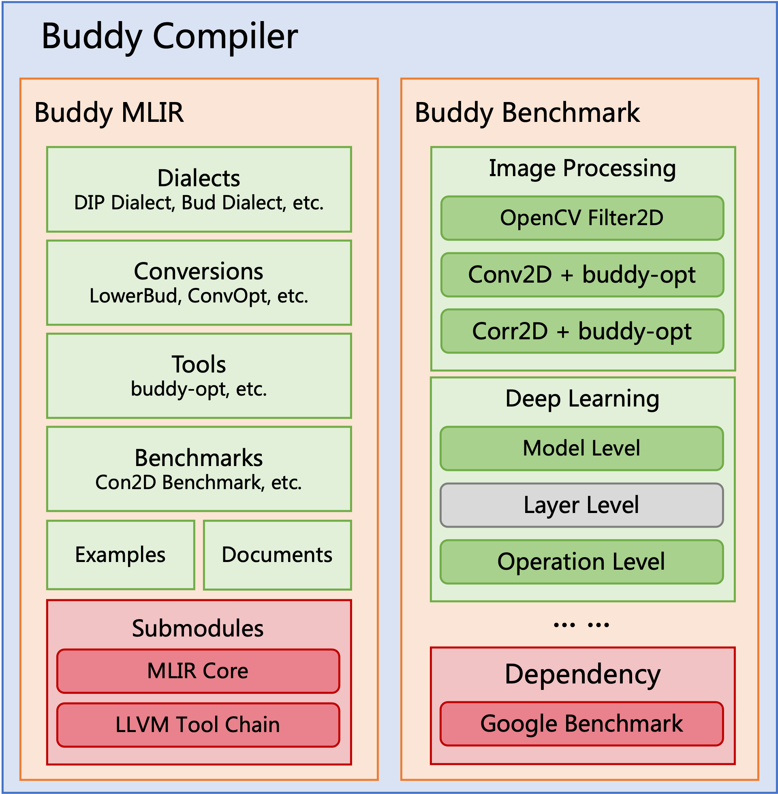

This is a temporary site to test home page of buddy compiler. 

Buddy compiler is a domain-specific compiler infrastructure. We use "buddy" as the name because our infrastructure intends to be the buddy system to help users easily design, implement, and evaluate domain-specific compilers.
The buddy compiler community welcomes any ideas. Join us through this slack link if you want to contribute.

## Motivation

With the development of domain-specific architectures and languages, the need for compilers has grown, and the research of compiler technology has reached a golden age. Implementing an end-to-end compiler from scratch for a new DSA or DSL is difficult. Our goal is to provide a framework to help users quickly implement a domain-specific compiler, including DSL frontend support, IR-level optimization, and DSA backend code generation. 

MLIR is a revolutionary multi-level intermediate representation and compiler infrastructure that provides reusable and extensible mechanisms. RISC-V is open-sourced instruction set architecture with a modular design, allowing custom extensions. MLIR and RISC-V have extensible concepts for domain-specific design and maximize the reuse of base parts. We thus particularly embrace the MLIR and RISC-V ecosystems for our framework and believe MLIR is a perfect companion for compiler development towards the RISC-V backend. As for the DSL frontend support, we do not have a clear plan and looking forward to more discussion.

Our work is still in the very early stages, and we are currently exploring IR-level optimization and building infrastructures. For more information, please see our work plan and open projects.

## Overview

Currently, the buddy compiler contains the following two modules:

- buddy-mlir (get started from here)

The buddy-mlir is the MLIR-based domain-specific compiler framework. We use MLIR as the cornerstone and explore how to build a domain-specific compiler on top of it. Our research in this framework includes domain-specific IR and optimization, domain-specific compiler frontend design and implementation, MLIR-related development tools, etc.

- buddy-benchmark (get started from here)

The buddy-benchmark is a benchmark framework to evaluate domain-specific compilers and libraries. Evaluation is an essential step in developing a compiler. We can hardly find a unified benchmark to evaluate compiler or optimization in some domains. We thus propose an extensible benchmark framework to collect domain-specific evaluation cases.

The graph below shows the modules of the buddy compiler.

## Workflow

Currently, our efforts are mostly at the IR level, so we provide domain-specific IR operations and functions, wrap them into the C++ library, and use CPU with SIMD extensions as the target machine. Here we demonstrate an end-to-end image processing and classification application of our framework:

- Read image into MemRef container.
- Perform image processing.
- Classify the image.
- Evaluate the performance.

What should be done to support this end-to-end application?

- Provide domain-specific data structure derived from the MemRef container.
- Define domain-specific MLIR dialect (operations, types, attributes).
- Implement lowering passes and optimizations towards the domain-specific MLIR dialect.
- Import the deep learning model into the MLIR function.
- Define domain-specific functions with MLIR operations.
- Compile the MLIR files into object files.
- Wrap C++ interfaces around the MLIR functions.
- Write a domain-specific application in C++ with the interfaces.
- Compile the main program and link the object files.
- Run the program and evaluate the performance.
